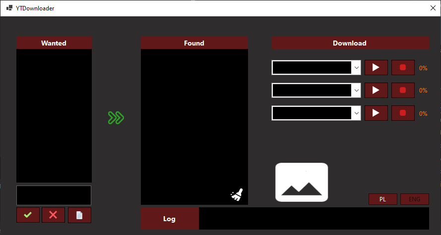
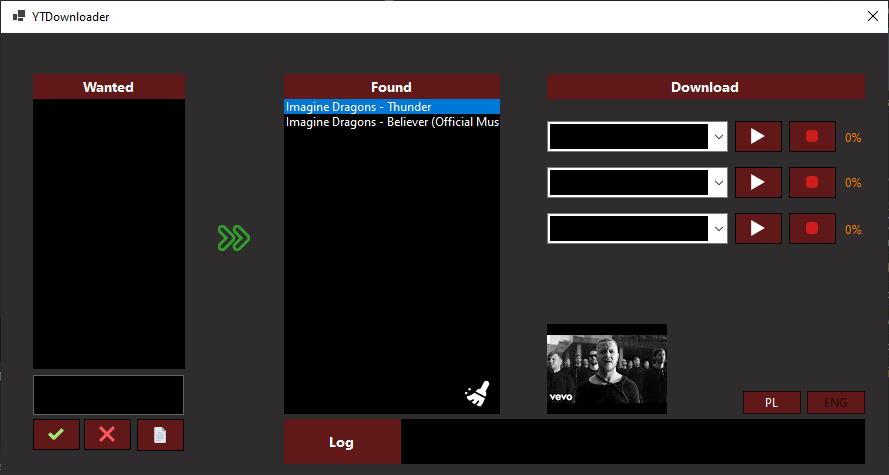
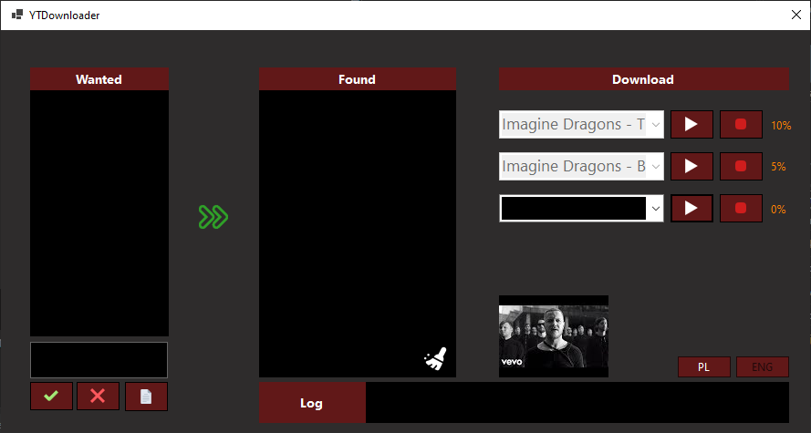
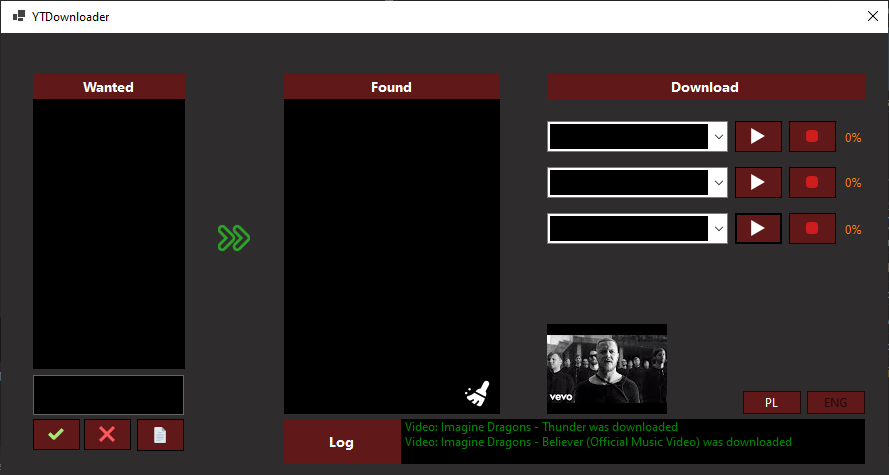

# YTDownloader
It is a simple application for downloading videos from YouTube

## Main features
* Adding videos to the wanted list by video name or link
* Searching for videos and adding them to the found list
* In the found list, you can click on the video to see a thumbnail
* You can download selected video from the found list
* You can download all videos from the found list
* You can clear the found list
* Available in two languages: English, Polish

## Screenshots

